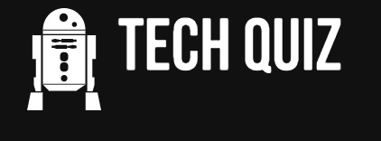
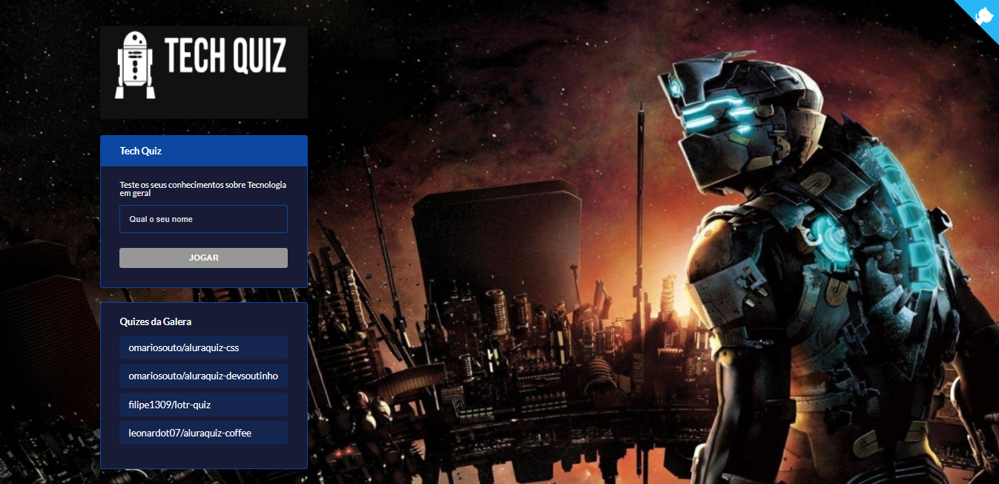

<h1 align="center">
    
</h1>

<p align="center">
  <a href="#-tecnologias">Tecnologias</a>&nbsp;&nbsp;&nbsp;|&nbsp;&nbsp;&nbsp;
  <a href="#-projeto">Projeto</a>&nbsp;&nbsp;&nbsp;|&nbsp;&nbsp;&nbsp;
  <a href="#-layout">Layout</a>&nbsp;&nbsp;&nbsp;|&nbsp;&nbsp;&nbsp;
  <a href="#memo-licença">Licença</a>&nbsp;&nbsp;&nbsp;|&nbsp;&nbsp;&nbsp;
  <a href="#produção">Produção</a>
  
</p>

<p align="center">
 

  
</p>

<br>

<p align="center">
  
</p>


[](https://youtu.be/ssGIy7p5Qx0 "TechQuiz")

## 🚀 Tecnologias

Esse projeto foi desenvolvido com as seguintes tecnologias:

-   [Nextjs](https://nextjs.org/)
-   [Styled Components](https://styled-components.com)
-   [Vercel](https://vercel.com)
-   [Framer-Motion] (https://www.framer.com/motion/)


## :rocket: Executando o projeto

```bash
npm run dev


## 💻 Projeto

Este projeto foi criado durante a Imersão React Next.js da Alura. A proposta foi criar um Quiz com tema livre. Escolhi o tema de Tecnologia. 

## 🔖 Layout

No link abaixo você encontra o layout do projeto web. Lembrando que você precisa ter uma conta no [Figma](http://figma.com/) para acessá-lo.

- [Layout Web](https://www.figma.com/file/cg1MIzSRRss8ggpypQbmdD/AluraQuiz?node-id=0%3A1)


## :memo: Licença

Esse projeto está sob a licença MIT. Veja o arquivo [LICENSE](LICENSE.md) para mais detalhes.


## :computer: Produção

[Link de acesso :dizzy:](https://techquiz.luizfbarbosa.vercel.app/)

---

Feito com 💛️ por Luiz Fernando 
